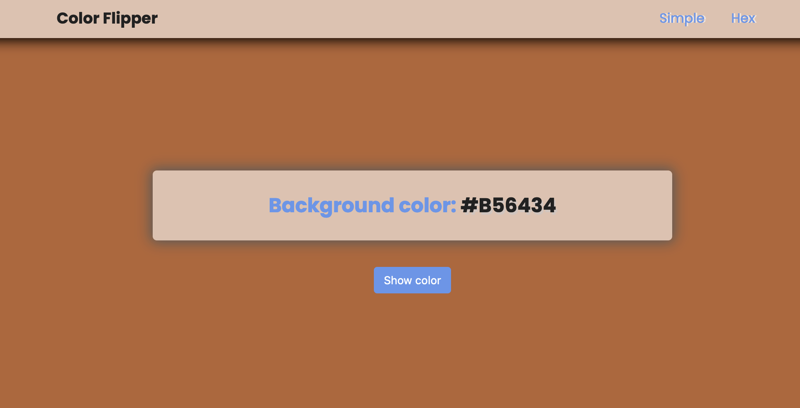

# Color flipper

- [Overview](#overview)
- [The challenge](#the-challenge)
- [Link](#link)
- [Built with](#built-with)
- [What I learned](#what-i-learned)
- [Author](#author)

## Overview

## The challenge

The color flipper is based on [this project](https://www.freecodecamp.org/news/javascript-projects-for-beginners/#how-to-create-a-color-flipper) to put in practise JS arrays, iteration and DOM manpulation. Once the button is clicked, the website's background color changes.
Try to practise on your own, google and make mistakes. If you get very stuck, have a look at the code.

### Link

- Solution [here](https://simple-hex-colorflipper.netlify.app/)

### Built with

- HTML & CSS
- Responsive design
- JavaScript

### What I learned

JavaScript concepts to learn and practise:

- Arrays and array property length
- Match.floor() and Math.random() methods
- Loops
- DOM Manipulation: selectors, style modifiers, event listeners

Happy coding! 🤓

## Author

- Website - [www.cristina-padilla.com](https://www.cristina-padilla.com)
- Twitter - [@crispitipina](https://www.twitter.com/crispitipina)
